# Domain Controller
- Setups creating new users for Active Directory
- Enabling Remote Access for users to the domain
- Connect the user to DHCP from the available IP addresses
- Learning to use Windows Server

### Download
- https://www.virtualbox.org/wiki/Downloads
- https://www.microsoft.com/en-us/evalcenter/evaluate-windows-server-2022
- https://www.microsoft.com/en-us/evalcenter/evaluate-windows-11-enterprise

### Prerequisites 
1. Install VirtualBox
2. Download Windows Server 2022 & Windows 11 Enterprise (ISO Version file)

## Setting Up Client 
1. In VirtualBox, create new VM (Virtual Machine), name the instance and select a file for ISO with a similar like the image, change the Hard Disk space to 50GB.
     - After you may be prompted to boot from disk, cancel this popup. Instead, press any key to enter Boot Manager Menu and select Reset.
     - Now you will be installing Windows 11, might need to restart the VM in case of black screens/unresponsive.
     

2. After completing the install and reaching the desktop screen of Windows. You can power off the machine.
     - Go to settings in VirtualBox and in the Network tab.
     - Update the Adapter from NAT to Internal Network.
   

  
## Setting Up Domain Controller
1. In VirtualBox, create new VM, name the instance and select file with similar name for ISO in image, for Version select Other Windows (64 bit), for Edition its Desktop Experience to get the GUI. 
     
   
2. After finish installing and powering off the machine, go to settings in VirtualBox for the instance.
     - Leave Adapter 1 as NAT but enable Adapter 2 and set as Internal Network.
       

## Windows Server
1. In the instance for Domain Controller, go to Devices > Insert Guest Additions CD image.
   - Go to File Explorer > CD Drive > VBoxWindowsAdditions-amd64.
   - Click Next for all steps and install.  
      

2. Type into search to get Network Connections.
   - Right click Ethernet 1 > Status > Details. The IP Address starts with 10.XXX.XXX.XXX, then we will rename it as INTERNET.
   - Right click Ethernet 2 > Status > Details. The IP address should start with 169.254.XXX.XXX since its an APIPA Address. We have to update the IPv4 Properties by right clicking > Properties > Internet Protocol Version 4 > Copy the addresses from image. Then, lastly rename it to INTERNAL.  
         

     
## Adding Active Directory, DHCP Server, Remote Access
1. In Server Manager > Add roles & features > click Next until Server Roles > copy from image.
2. At the section for Role Services via Remote Access, select Routing which will autocheck DirectAccess as well after doing so.  
   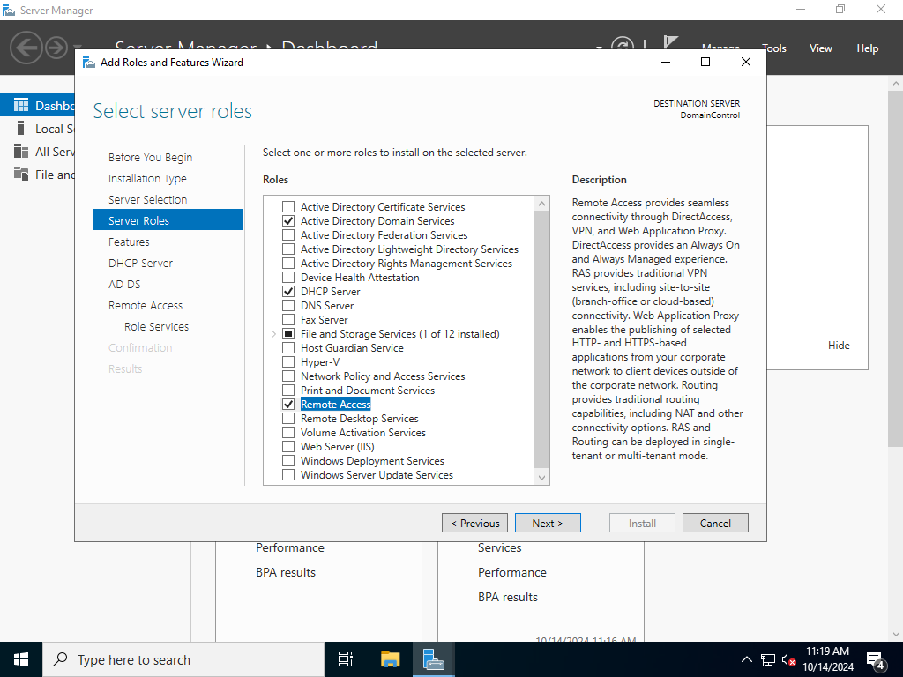 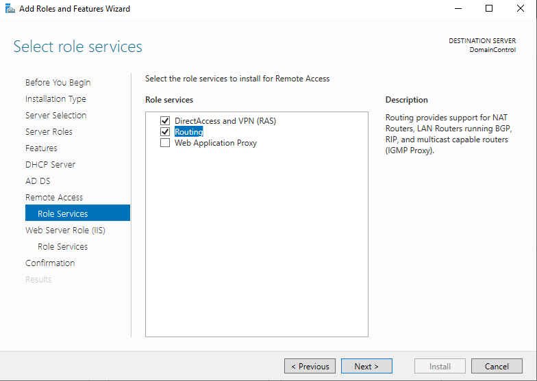
3. Click Next for rest of steps and install.

## Configuring Active Directory Domain Services
1. After installing, in Server Manager click the flag in top right > Promote server to Domain Controller.
2. In the installation wizard > copy from image
   - Create password for Restore Mode (won't be needed for later)
   - Click Next for rest of steps
   - Install  
   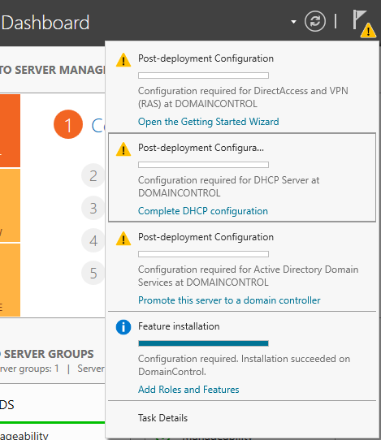   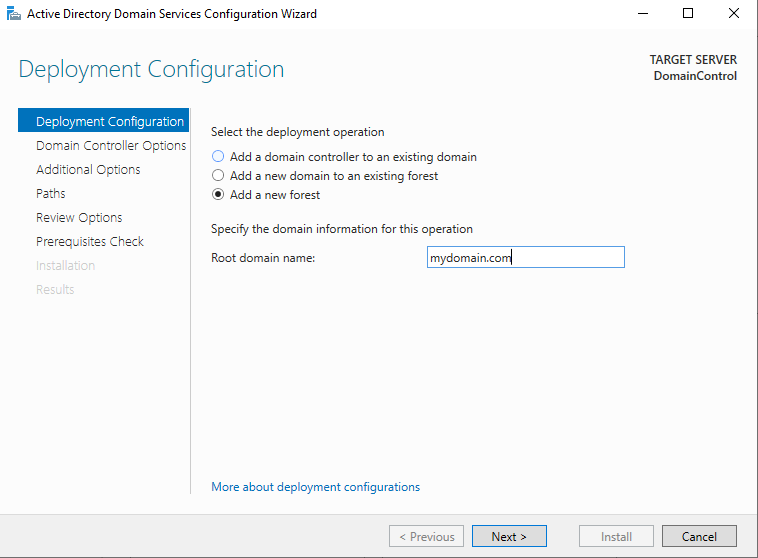

## Configuring Remote Access
1. In Server Manager, go to Tools and select Routing & Remote Access
2. Right click the local server, select Configure & Enable
3. Select NAT for configuration
4. Lastly, before finishing select INTERNET for public interface to finish rest of steps.  
   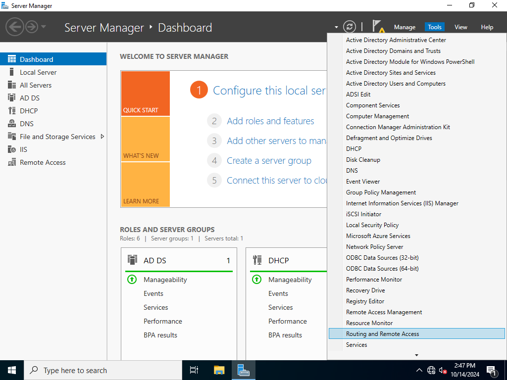 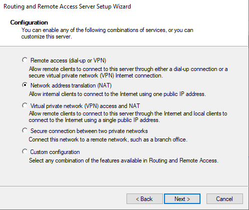 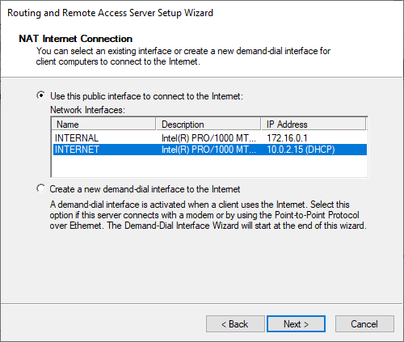

## Configuring DHCP
1. In Server Manager, go to Tools and select DHCP
2. Double click into your domain's server name > Right click IPv4 > Select New Scope
   - Name your scope 172.16.0.100-200
   - For IP Address Range, copy from image (172.16.0.100 - 172.16.0.200) (Length: 24)
   - Click Next until Default Gateway, copy from image (172.16.0.1)
   - Get to finish for the wizard  
        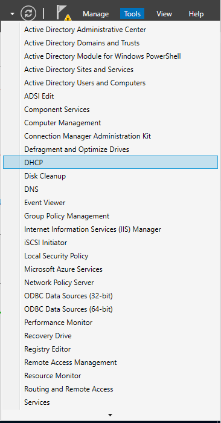   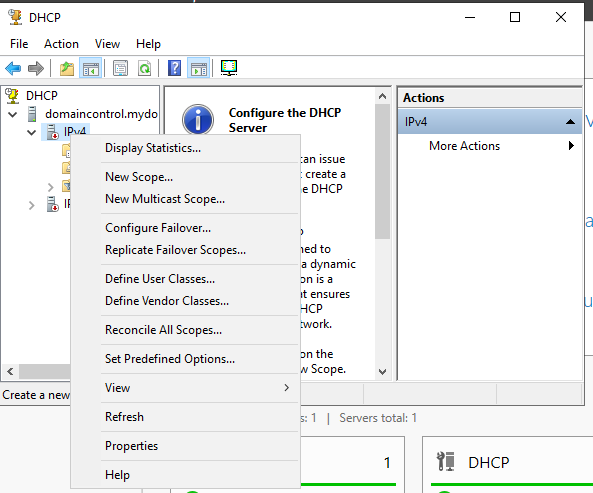
        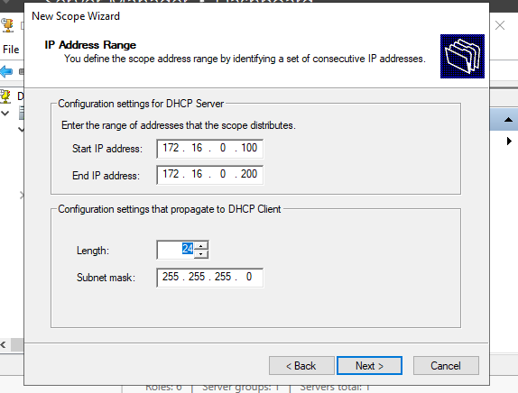   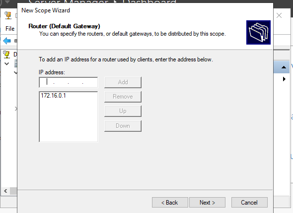
3. Now, right click your domain's server name > Right click to authorize

## Adding User to Active Directory
1. In Server Manager, go to Tools and select Active Directory Users & Computers
2. Right click your domain > New > User
3. Fill out the fields for the new user > Finish
4. Now, for that new user, right click into Properties > Member of > Add > Enter "Domain Admins" > Click Check Names  
        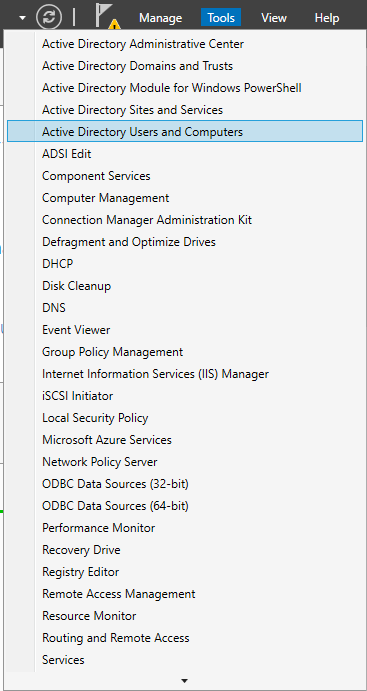   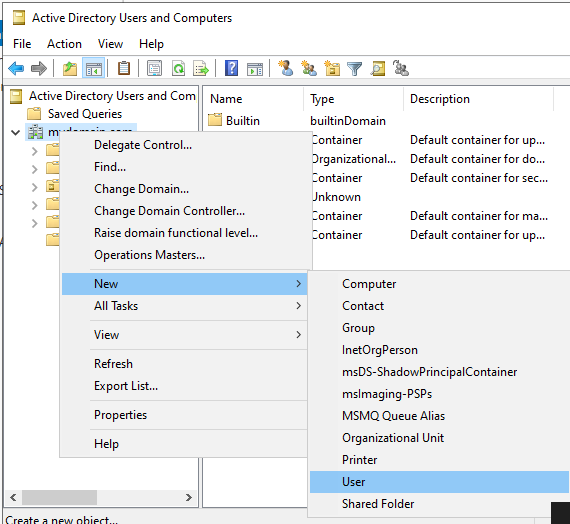
        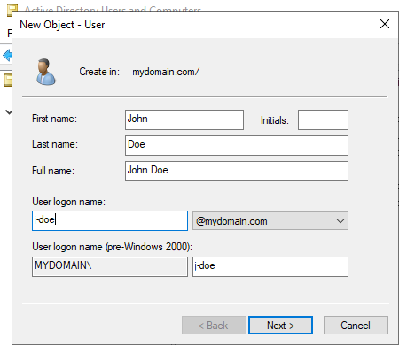   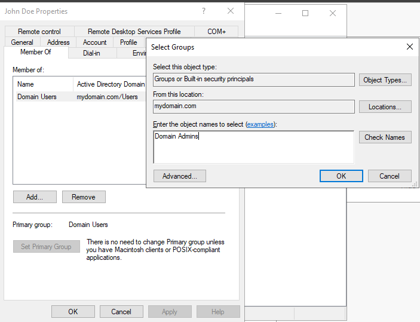

