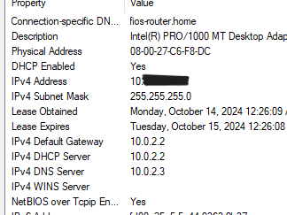

# Domain Controller

## Download

- https://www.virtualbox.org/wiki/Downloads
- https://www.microsoft.com/en-us/evalcenter/evaluate-windows-server-2022
- https://www.microsoft.com/en-us/evalcenter/evaluate-windows-11-enterprise

## Prerequisites 
1. Download & Install VirtualBox
2. Download Windows Server 2022 & Windows 11 Enterprise (ISO Version file)

### Steps
### * Add screenshots for each step and explain what each screenshot is doing
### * Add links for downloads (VirtualBox, Microsoft 11 Server, Windows 11)

# Setting Up Client 
1. In VirtualBox, create new VM (Virtual Machine), name the instance and select a file for ISO with a similar like the image, change the Hard Disk space to 50GB.
     - After you may be prompted to boot from disk, cancel this popup. Instead, press any key to enter Boot Manager Menu and select Reset.
     - Now you will be installing Windows 11, might need to restart the VM in case of black screens/unresponsive.
  
     

2. After completing the install and reaching the desktop screen of Windows. You can power off the machine.
     - Go to settings in VirtualBox and in the Network tab.
     - Update the Adapter from NAT to Internal Network.
  
   
  
# Setting Up Domain Controller

1. In VirtualBox, create new VM, name the instance and select file with similar name for ISO in image, for Version select Other Windows (64 bit), for Edition its Desktop Experience to get the GUI. 
     
   
2. After finish installing and powering off the machine, go to settings in VirtualBox for the instance.
     - Leave Adapter 1 as NAT but enable Adapter 2 and set as Internal Network.
  
       

# Windows Server

1. In the instance for Domain Controller, go to Devices > Insert Guest Additions CD image.
        - Go to File Explorer > CD Drive > VBoxWindowsAdditions-amd64.
        - Click Next for all steps and install.  
           

2. Type into search to get Network Connections.
        - Right click Ethernet 1 > Status > Details. The IP Address starts with 10.XXX.XXX.XXX, then we will rename it as INTERNET.
        - Right click Ethernet 2 > Status > Details. The IP address should start with 169.254.XXX.XXX since its an APIPA Address. We have to update the IPv4 Properties by right clicking > Properties > Internet Protocol Version 4 > Copy the addresses from image. Then, lastly rename it to INTERNAL.  
         

